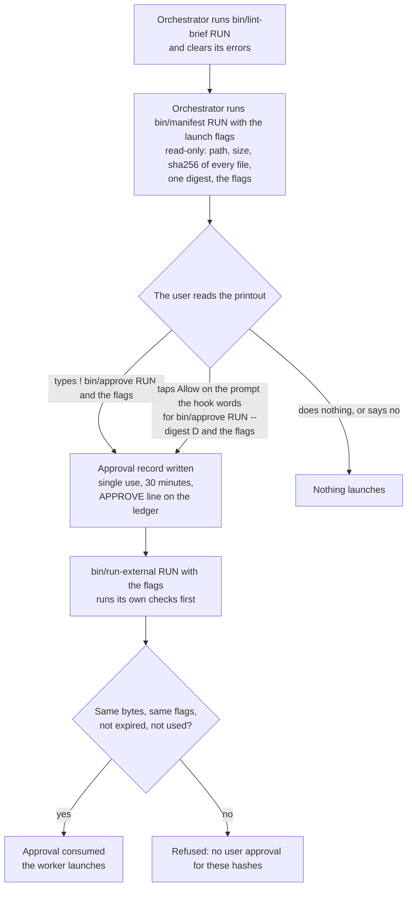

# The approval gate

This page answers: why does every launch and every append to the claims record need the user's approval, and
what exactly does an approval bind?

## Why a gate, and not a rule

The workspaces the kit came from had a written rule against launching without the user's go, and runs were
launched anyway:
once on a "go" that meant the edits under discussion, with a brief carrying edits the user had not read. Prose
rules did not stop it. What stops it is a tool that refuses
(→ **Every launch and every ledger append consumes a byte-bound, single-use, 30-minute user approval**).

So an approval is not a sentence in a conversation. It is a record written by a tool the user runs, bound to the
exact bytes the user was shown, and consumed by the tool that acts on it
([RULES.md §6](../../RULES.md#6-approvals--the-gate)). A misread go then ends in a refusal rather than a launch.

## What needs one

| kind | what it allows | the tool that consumes it | what the approval binds |
|---|---|---|---|
| launch | one worker run (or several, as a batch) | [`bin/run-external`](../reference/tools/run-external.md) | every regular file in the run directory except the launch's own logs, and the launch flags |
| ledger | an append of named claims to `CLAIMS.md` | [`bin/ledger-claims`](../reference/tools/ledger-claims.md) | the ids, the run's `claims.json`, `check.json`, `verdict.md`, every live `referee.json` of those ids and its binding (`data/referee-bindings/`), the cross-family rulings when there are any, and `CLAIMS.md` |
| annotate | a note on an existing entry (or a batch of notes) | [`bin/annotate-claim`](../reference/tools/annotate-claim.md) | `CLAIMS.md` and the note text (or the notes file) |
| session | a headless session on another provider's model | [`bin/astra-session`](../reference/tools/astra-session.md) | its command line |

The kinds and their manifests are defined in [`bin/_approval.py`](../reference/tools/_approval.py.md).

## The sequence

Step by step:

1. **Lint, then manifest.** [`bin/lint-brief`](../reference/tools/lint-brief.md) catches unfilled slots, misplaced
   fields and blocked material before anyone is asked to approve
   (→ **`bin/lint-brief` before `bin/manifest`**). [`bin/manifest`](../reference/tools/manifest.md) takes the same
   arguments as the approval tool and prints the same thing, but approves nothing. The orchestrator shows that
   printout.
2. **The user approves**, by one of two routes (below), with [`bin/approve`](../reference/tools/approve.md).
3. **The tool consumes it.** The approval record is renamed into a `used/` directory, atomically, so two racing
   launches cannot both succeed. A launch then sets up (a search gateway, Codex's model catalog), and reads the run's
   bytes again against the used approval just before its worker starts (→ **The approval holds until the worker starts,
   and binds the claim**). An append takes a lock on `CLAIMS.md` and spends its approval only once every entry is
   built.

## Two ways to approve

**At the terminal.** The user types the approval command with the shell-escape prefix `!`. Those commands do not
pass through the hook, which was tested by planting a marker in each kind of command and reading the hook's debug log;
that is what makes the approval the user's act and not the orchestrator's (→ **`!` commands do not pass through
the hook**).

**By a tap.** The orchestrator may offer the approval command as one plain call, carrying `--digest` with the digest
from the manifest printout. The hook does not let it run unasked: it computes a prompt from the bytes themselves, opening with
`USER APPROVAL (single use, 30 min):`, and the user's Allow is the approval. The hook refuses to offer the
prompt when:

- the call carries no `--digest` (a `--session` approval is exempt), the bytes no longer match it, or the approval
  tool would refuse its arguments for another reason;
- the call is not run from the project root;
- the session is in a permission mode where a prompt is not known to reach the user;
- any settings file holds an allow rule that would let the call through without a prompt. "Don't ask again" would
  write exactly such a rule, which is why the user never chooses it (→ **The tap route needs `--digest`**).

The tap is offered for a Bash call only: a Monitor command naming the approval tool is refused (→ **A tool that runs a
shell command is gated as Bash is**). The digest requirement exists because a tap can be a reflex; the source's
predecessor measured that. A digest from a printout the
user has seen ties the tap to that printout. Every refusal the hook gives is listed in
[hook refusals](../reference/hook-refusals.md).

## What an approval binds, and what voids it

The manifest's **digest** covers the kind, the key (a run name, an entry id, a notes batch's name or the session's), the ids and every file's sha256. The
**flags** of a launch are bound beside it in the same record and printed under it. A launch approval must bind its
flags, `--model` included: an approval of the bytes alone would let any model, effort, prompt or cap run
(→ **A launch approval binds its flags**). Flags compare as a set, so their order does not matter; a flag given twice
is refused, since the launcher would take the last (`--module` is the one flag given once per module); `--dry-run` and
`--detach` are never part of an approval.

At the moment of use, the approval is refused if any of these holds:

- a bound file changed, or a file was added to or removed from the run directory;
- the flags differ from the approved ones, or the ids differ;
- thirty minutes have passed since it was written;
- it was already used;
- for a launch, the bytes read again just before the worker starts differ from the approved ones (the approval is
  then spent, and the launch refused).

The refusal reads `no user approval for these hashes`, and that refusal is the stop
(→ **The manifest is shown first**). One approval is kept per kind and key; a second one replaces the first and says
so (→ **One approval for several notes; a replaced approval is announced**).

## Checks that spend nothing

The launcher runs every check it can make without the approval before it touches the approval
([RULES.md §6](../../RULES.md#6-approvals--the-gate)). Among them: a brief that allows more tool calls than the turn
cap, a harness note that does not match the route, a run directory holding an earlier launch's record or output (a
`licence.log` or a written outbox included, as the approval does not hash them), a run name used in two workspaces, a
packet carrying blocked material, and a host whose settings do not register the hook. A refusal at that stage leaves the
approval unspent. The exit codes are in [exit codes](../reference/exit-codes.md).

For notes, `bin/annotate-claim --dry-run` runs every check except the approval, so a refused text never costs one.

## Several at once

- **Batch consent.** Several runs named in one approval are one consent for exactly those runs. A batch tap takes one
  digest per run, in order, and one mismatch refuses the whole call (→ **Batch tap**). The user is told how many
  runs one tap covers.
- **A queue.** Runs approved together can launch one after another with `bin/run-external --queue`. Every approval is
  used at the queue's start, so none expires while an earlier run works, and each run is released only with the
  approved flags and unchanged bytes (→ **A queue for runs approved together**). A queue stops releasing after a run
  that ended on the plan's usage limit or a capacity refusal (→ **A queue stops at the plan's usage limit**). A queue
  that fails while using its approvals names the ones it spent.
- **Several notes.** One approval of a notes file covers every note in it, printed in full, appended all or none.

Two practices go with this, from [RULES.md §6](../../RULES.md#6-approvals--the-gate): while a queue releases, nothing
creates or removes files in its tree (no test suites, commits or file moves;
→ **Nothing creates or removes files in a tree while its queue releases runs**), and while a run waits for its
approval or its launch, nothing the packet scan reads changes
(→ **Between an approval and its launch, no scanned file changes**). Both are practices, not checks: what they guard
against is a launch-time refusal after the approval is already spent.

## Where approvals live

An approval is a small JSON file under `.claude/state/approvals/`, outside every run directory so no worker can write
one, and gitignored. Its durable trace is the `APPROVE` line on the ledger, written with the user as actor. The
hook refuses the orchestrator anything touching that directory: a Read, Grep or Glob there or rooted above it, an
edit, and any command that names it ([RULES.md §9](../../RULES.md#9-the-sandbox--enforced-not-convention),
→ **The orchestrator reads neither the locked data nor the approval records**).

RULES.md §6 asks that runs approved in one session and launched in another be approved again in the launching
session, against the bytes as they then are ([RULES.md §6](../../RULES.md#6-approvals--the-gate)). The approval record
itself names no session, so this is a practice the tools do not check.

## What consent covers in words

Not everything needs an approval record, but the operator's words are read the same way: "do all of X" covers all of X
and nothing beside it, a go attached to another instruction covers that instruction only, and silence is not approval
([RULES.md §6, "What consent covers"](../../RULES.md#what-consent-covers), → **Batch consent**,
→ **Never read a permission more widely than its words**).

## What the gate stops, and what it does not

It stops **a misreading followed by an ordinary command**: a go read too widely, a brief edited after it was shown, a
launch with a different model or cap than the one approved, an append of ids nobody approved.

It does not stop **a deliberate forgery**. The orchestrator runs as the user's own user, so a determined process
could write an approval record itself. The kit accepts this limit by design
([RULES.md §6, "Limit, accepted by design"](../../RULES.md#6-approvals--the-gate)). The hook's checks match commands
and paths by name; a constructed path or a glob gets past them, and the kit does not claim otherwise.

It also does not read for the user. An approval binds what the printout showed; whether those bytes deserve to
run is the user's judgement. `--show` prints every file's contents beside the hashes for a user who wants
to read them there.

## Related

- [Approving](../guides/approving.md): the guide, with the commands.
- [The trust model](trust-model.md): what the append records.
- [The sandbox](sandbox.md): what a launched worker can reach.
- [Glossary](../reference/glossary.md).
