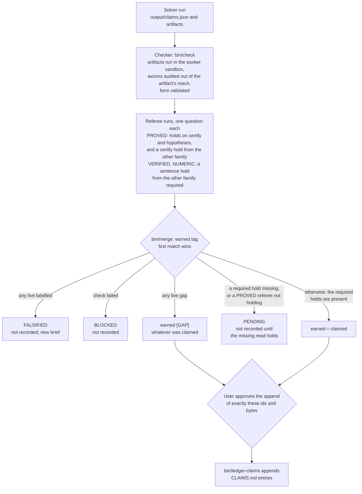

# The trust model

This page answers: what does a tag like `[PROVED]` mean on the record, and who decides that a claim has earned it?

## One rule underneath

The kit is built around one sentence: whoever produced the work does not get to certify it
([RULES.md §1](../../RULES.md#1-rule-zero), → **Whoever produced the work does not get to certify it**). A solver that
writes a proof is not the one who says the proof holds, and neither is the orchestrator that briefed it.

Certification comes from two kinds of reader, in this order of preference:

- **An artifact**, wherever one can certify: a proof assistant's kernel, an exact-arithmetic script, a coverage
  certificate, a re-find of a known object (→ **Certify with artifacts wherever an artifact can**).
- **A referee**, a fresh worker that answers one typed question, where no artifact can. The question no script can
  answer is whether the English sentence says what the formal statement or the script actually establishes.

Everything else on this page is the apparatus that keeps that rule true when the producer, the orchestrator and the
referees are all language models.

## What the tags say

Every substantive statement carries one of six tags. [RULES.md §2](../../RULES.md#2-claim-tags--mandatory-on-every-substantive-statement)
sets the bar for each; read informally, a reader of the record can take them as:

| tag | what a reader may take from it |
|---|---|
| `[PROVED]` | a complete proof whose check passed (or had nothing to run) and that every live referee held, on both questions (`certify`, `hypotheses`), including a `certify` reader of the other model family |
| `[VERIFIED]` | a finite computational fact: the script met the checker's expectations (exit status, pinned output), and under the current claims schema a `sentence` referee of the other family held that the English says exactly that, on exactly the stated range |
| `[NUMERIC]` | true on the tested range or sample, and nothing beyond it |
| `[CONJECTURE]` | believed, with the evidence and the strongest pressure against it |
| `[HEURISTIC]` | a plausibility argument, with its non-rigorous step named |
| `[GAP]` | a known hole, with what must be shown; an argument containing one is not a proof |

The bar for each tag is the one in RULES.md §2; the table says only what the tools check. Some of the bar is not
checked by a script: exact arithmetic is the brief's and the `sentence` referee's to judge (the checker counts float
tokens as an advisory). A `[VERIFIED]` coverage claim with no mutation run by the check (none declared, or a check
without `--mutate`) is flagged `mutations_missing` by
[`bin/check`](../reference/tools/check.md) and records as `[NUMERIC]`, as RULES.md §8 states. For a Lean artifact the
axioms are collected by the kit's own program from the compiled artifact, after the kernel has replayed it, in a sandbox
call that runs no artifact code; never from the artifact's own file, where its macros apply (one made a theorem proved
by `sorry` print "does not depend on any axioms"; → **The axiom audit runs where the artifact's syntax cannot reach**).

The words in the [glossary](../reference/glossary.md) (claim, artifact, referee, earned tag) are used here as defined
there.

## Claimed tag and earned tag

A solver *claims* a tag in `output/claims.json`. The record holds the tag the claim *earned*, which is computed, not
argued ([RULES.md §8, "Claim form"](../../RULES.md#claim-form--the-schemas-are-law-schemasmd),
→ **Earned tag: falsified > check fail > gap**). [`bin/merge`](../reference/tools/merge.md) computes it into the run's
`verdict.md`; [`bin/ledger-claims`](../reference/tools/ledger-claims.md) computes it again at the append, validating
the claims document and each claim itself (a schema the worker declared is not taken on its word), and refuses
anything that is not recordable. The full table is
[SCHEMAS.md §4](../../SCHEMAS.md#4-earned-tag--binmerge-computes-binledger-claims-enforces); the first match wins:

1. Any live referee says `falsified`: **FALSIFIED**, not recorded; the next step is a new brief.
2. The check failed: **BLOCKED**, not recorded.
3. Any live referee says `gap`: recorded as `[GAP]`, whatever was claimed, with the referee's pointer.
4. A read the earned tag requires has no live hold: **PENDING**, not recorded. For `[PROVED]` that is its check (pass,
   or nothing to run; a claim missing from `check.json` is not checked), a live referee that holds (every live referee
   must hold), a live hold on both questions, and a live `certify` hold from the other model family; for `[VERIFIED]`
   and `[NUMERIC]` under `kit/claims/2`, a live `sentence` hold from the other family.
5. Otherwise the claim earns what it claimed.

So a `[PROVED]` claim can come out as `[GAP]`, and the entry then says both what was claimed and why it earned less.

## The cycle, and where a claim stops

[`bin/close-run`](../reference/tools/close-run.md) runs the check and the merge in one command, prints the referee
line for every `[PROVED]` claim still lacking a hold, and prints the approval and append lines. It launches nothing and
appends nothing (→ **`bin/close-run` performs steps 2 and 4**). The cycle as a whole is in
[RULES.md §5](../../RULES.md#5-the-cycle) and [FLOW.md](../../FLOW.md#the-cycle).

## Who decides what

| step | decided by | what it can say |
|---|---|---|
| the claim and its tag | the solver, in `claims.json` | what it believes it established |
| pass or fail of the artifact | the checker, a script | `pass`, `fail` or `n/a` per claim; it never argues (→ **Checker is a script, not an LLM**) |
| one question about one claim | a referee | `holds`, `falsified`, `gap` or `unverifiable`, one pointer, at most three lines |
| the earned tag | `bin/merge`, by the table above | nothing a person or a model chooses |
| whether it goes on the record | the user, by an approval bound to the bytes | yes to exactly these ids, or nothing |

Nobody adjudicates between referees. Disagreement resolves mechanically: one `gap` against one `holds` gives `[GAP]`.
The three-line bound on a referee's note is what lets the user read every verdict directly and rule
([RULES.md §7](../../RULES.md#7-standing-rules-that-keep-cycles-convergent),
→ **`referee.json` has exactly six fields**). A note that breaks the bound makes the file invalid, and an invalid
verdict does not count.

## Two questions, and the other family

RULES.md asks that a `[PROVED]` claim get two referees asking different questions: `certify` (does the artifact
certify the statement at this tag?) and `hypotheses` (does the English carry every restriction the artifact needs?),
and beside that pair a `certify` read from the other model family than its producer's
([RULES.md §7](../../RULES.md#7-standing-rules-that-keep-cycles-convergent)). The two questions are decorrelated by
the question, not by the model. On the source workspace's record, two models gave identical verdicts on a whole
ladder, while the two questions disagreed on a real overclaim
(→ **Two referees per PROVED claim, one per question**). The cross-family read guards against a blind spot a whole
family shares (→ **A cross-family certify read**).

The earned tag enforces all of it. For `[PROVED]`, [`bin/merge`](../reference/tools/merge.md) and
[`bin/ledger-claims`](../reference/tools/ledger-claims.md) need every live referee to hold, a live hold on both
questions (`certify` and `hypotheses`), and a live `certify` hold from the other family, so no single referee can
satisfy it; [`bin/close-run`](../reference/tools/close-run.md) prints the run for a missing question
([SCHEMAS.md §3](../../SCHEMAS.md#3-outputrefereejson--written-by-a-referee-run-exactly-these-six-fields)).

The family is read from the models that answered the producing run, from its own record, or, with none recorded,
from the run's approved `--model`; an unknown producer is met only by the user's ruling, recorded by the user in
`data/cross-family-rulings.json`, never in a run directory (the worker writes there). A family is matched by a whole
word of the model's name, never by any prefix.
[SCHEMAS.md §4](../../SCHEMAS.md#4-earned-tag--binmerge-computes-binledger-claims-enforces) says how the family is
determined.

A script claim (`[VERIFIED]` or `[NUMERIC]`) passes its check on the script's exit, but a script can pass while the
sentence above it says more than the script asserts. So under the current claims schema it also needs a `sentence`
read from the other family: does the English say exactly what the checker asserts, on exactly the stated range
(→ **A sentence referee reads every script claim**). One `sentence` hold from the other family meets both
requirements.

`[CONJECTURE]`, `[HEURISTIC]` and `[GAP]` claims earn their claimed tag once they are well formed, unless a live
referee falsified or gapped them; like any claim, they reach the record only on the user's approval.

## What a referee is allowed to count

A referee sees one claim, its artifact, the files the claim declares as `deps`, and the problem statement
([RULES.md §7](../../RULES.md#7-standing-rules-that-keep-cycles-convergent)). Two boundaries shape its verdict:

- **The evidence boundary.** A hypothesis is carried only if the English states it or the supplied material derives
  it. A referee's own derivation does not count, however short (→ **The evidence boundary**).
- **Silent links are obligations.** A claim names the links no artifact checks. Naming one locates the obligation; it
  does not discharge it (→ **Silent links first**).

Every question's brief says that an artifact certifying less than the English is a `gap`, never a `holds` with a
caveat.

## Verdicts are bound to bytes

A referee run is one [`bin/new-run`](../reference/tools/new-run.md) made, and it binds it outside every run
directory, in `data/referee-bindings/<run>.json`: its question, the claim it reads, the hash of that claim as the
solver wrote it, and the hashes of the artifact and deps it was given. The earned tag reads the referee's question and
those bytes from the binding, never from the run, where the worker writes; a `referee.json` in a run with no binding
(a solver's own, say) never counts (→ **What decides an earned tag is never in a run directory**). If the artifact, a
dep or the claim itself changes afterwards, the verdict is stale and does not count (→ **A verdict is bound to the
artifact copy**, → **The approval holds until the worker starts, and binds the claim**). The append is bound the same
way: the user's approval covers the run's `claims.json`, `check.json`, `verdict.md`, every live `referee.json` of the
named ids and its binding, the cross-family rulings, and `CLAIMS.md` as they were when approved; the deps are hashed
again at the append. See [the approval gate](approval-gate.md).

## What a tag does not promise

The mechanism makes a tag mean "this passed these specific checks"; it does not make the checks infallible.

- **Referees are measured, not trusted.** A model is meant to go through a ladder of known results with planted errors
  before its verdicts count in a role, and a ladder reads as coverage, not as a recall figure: the denominators are
  small (→ **Calibrate before trusting**, → **A ladder is a coverage challenge**). The rules record one exception:
  cross-family reads count before their families are calibrated, because they only add a requirement
  ([RULES.md §7](../../RULES.md#7-standing-rules-that-keep-cycles-convergent)).
- **An approved model is not an observed one.** The models that answered a run are read from its transcript and a
  fallback is flagged by the launcher, `bin/close-run` and `bin/ledger-claims`. It is flagged, never refused
  (→ **The model a worker ran on is recorded**). On the Claude routes the requested name is not compared with the
  answering model, so a run answered wholly by another model, with no fallback event and no second model, is not
  flagged.
- **A conditional claim is conditional.** An entry that rests on a published theorem, a source taken as stated or
  another entry says `(conditional: …)` in its header (→ **Premises on every claim**). `[PROVED]` there means proved
  from those premises.
- **Computer algebra needs a certificate.** A result that rests on a package earns `[VERIFIED]` only through a
  certificate an exact script re-checks, or two independent packages agreeing
  ([RULES.md §2](../../RULES.md#2-claim-tags--mandatory-on-every-substantive-statement)).
- **The record can be wrong and still be honest.** A later finding is a superseding claim if it changes the truth,
  or a note if it does not. Nothing is edited. See [the record](the-record.md).

## Related

- [The approval gate](approval-gate.md): how the append is approved.
- [Roles](roles.md): who the solver, referee and checker are.
- [Lessons](../../LESSONS.md): the incident behind each rule cited here.
